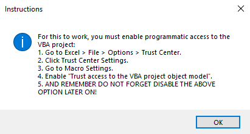

## PROJECTS OVERVIEW
This repository **ms-excel-projects** contains the files and folders that shows the usage of various Excel tools such as:
* Excel formulas and functions
* PivotTables, Power query and Power Pivot (upto certain extent)
* Excel VBA

---
### Project Breakdown
#### 📂 Excel VBA
This folder has 5 subfolders. Each subfolder contains two files:
1. **Documentattion** : *Text File* that explains what is the purpose of that Excel file, Subroutines and function procedures that are used.
2. **Application** : *Excel File* that shows the practical application and different ways using Excel VBA to achieve that objective.

---

#### 📂 ETL and Data Transformation
1. **AppendDataFromExcelWorkbook (Folder)**
	* **Tools** : PowerPiovt, Power Query and Basix Dax Formula.
	* **Process** : Combine data from external sources like Excel files and load them into PivotCache and PowerPivot Data Model.
	* **Result** : Dashboard is prepared using Data loaded to PowerPiovt, PivotTables, Slicers and charts
2. **Structuring Data to Proper Format (Folder)** 
	* **Tools** : Excel VBA
	* **Process** : Corrected date formats, removed blank rows and columns and filtered columns from external excel file.
	* **Result** : Data from external excel files now combined in a single worksheet in a proper format.
3. **Transposing Complex data**
	* **File**\
	📝 `Transposing Complicated Data with VBA.xlsm`
	* **Objective** : Converting data from single list format into a table format for each individual record.
4. **Data Cleaning Using Excel Formula (Folder)**
	* **Tools** : Dynamic array functions and various functions (`FILTER`, `LEN`, `LET`, `TEXTJOIN`)
	* **Objective** : To demonstrate how to clean the data bring it into readable and proper format.
	
---

⚠️ ***ATTENTION:***\
If you see the message like this one below when you click a button in Excel file:\
\
**Do this:**
1. Go to **File > Options > Trust Center**
2. Click on **Trust Settings Center** and **Select Macro Settings**
3. Check the box **Trust Access to the VBA object Model and click OK**

‼️IMPORTANT‼️\
**For security, it is recommended to disable this option once you are done viewing files on your local computer**